# ChainCommerce: AI-Powered Decentralized Marketplace, the future of Shopping

**Chainlink Hackathon Entry** - Amazon Bedrock AI integration for sustainable, cross-chain e-commerce

##  Complete Amazon Bedrock Integration Implemented!

✅ **AI Shopping Assistant** - Personalized product recommendations
✅ **Pricing Optimizer** - Dynamic pricing strategies for sellers
✅ **Dispute Resolution** - Automated AI analysis and resolution
✅ **Smart Contract Integration** - Chainlink Functions + AWS Bedrock
✅ **Production Ready** - Full UI, API routes, and documentation


## 🎯 The Problem

Current e-commerce platforms suffer from three critical issues:
- **Generic AI recommendations** based solely on purchase history, ignoring user values (sustainability, ethics, budget)
- **Trust gaps** with fake reviews, opaque pricing, and centralized dispute resolution
- **Cross-chain fragmentation** limiting liquidity and user choice across different blockchain networks

## 💡 Our Solution

A decentralized marketplace that combines ethical AI-driven recommendations with trustless smart contract escrow, enabling seamless cross-chain commerce.

### Core Features(POC)

| Feature | Chainlink Service | Real-World Impact |
|---------|------------------|------------------|
| **Ethical AI Recommendations** | Functions + AWS Bedrock | Personalized matching based on values, not just history |
| **Cross-Chain Product Discovery** | CCIP | Unified liquidity across Avalanche & Ethereum |
| **Trustless Escrow** | VRF + Automation | Eliminates payment fraud and dispute delays |
| **Dynamic Pricing** | Data Streams | Real-time price adjustments for crypto volatility |
| **Fraud-Resistant Reviews** | VRF + Proof of Reserve | Cryptographically secure reputation system |

## 🏗️ Technical Architecture

### Smart Contracts
- **ProductRegistry.sol** (Avalanche) - Product listings with metadata
- **AIEscrow.sol** (Ethereum) - Stablecoin escrow with automated release
- **CrossChainBridge.sol** - CCIP integration for cross-chain visibility
- **ReputationSystem.sol** - VRF-based review validation

### AI Integration
- **AWS Bedrock Claude Models** - Natural language product search and recommendations
- **Chainlink Functions** - Bridge on-chain preferences with AI models
- **Smart Pricing** - AI-powered dynamic pricing optimization
- **Dispute Resolution** - Automated analysis with fair resolution recommendations
- **Real-time data feeds** - Carbon footprint and supply chain transparency

## 🔄 User Flow(POC)


### Complete Shopping Journey

#### 1. **User Onboarding & Preferences** 🎯
- **Account Creation**: Connect wallet (MetaMask, WalletConnect)
- **Preference Setup**: Define values (sustainability, budget range, delivery speed)
- **AI Profile**: Machine learning model learns from initial questionnaire
- **Cross-Chain Setup**: Automatic detection of supported networks (Ethereum, Avalanche)

#### 2. **Smart Discovery** 🔍
- **Natural Language Search**: "Find eco-friendly headphones under $200"
- **AI Recommendation Engine**: AWS Bedrock analyzes preferences + real-time data
- **Cross-Chain Results**: Products aggregated from all supported networks
- **Ethical Scoring**: Carbon footprint, labor practices, supply chain transparency
- **Dynamic Filtering**: Price volatility adjustments via Chainlink Data Streams

#### 3. **Intelligent Purchase Flow** 💳
- **Product Selection**: Detailed view with AI-generated compatibility scores
- **Cross-Chain Transaction**: CCIP handles network bridging automatically
- **Smart Escrow**: Funds locked in trustless contract pending delivery
- **Payment Options**: USDC, USDT, ETH with automatic conversion
- **Dispute Protection**: Built-in arbitration system ready if needed

#### 4. **Automated Fulfillment** 📦
- **Seller Notification**: Instant on-chain order confirmation
- **Shipping Integration**: Chainlink Automation monitors tracking APIs
- **Milestone Payments**: Partial releases at pickup, transit, delivery
- **Delivery Verification**: GPS + signature confirmation triggers final payment
- **Real-time Updates**: Push notifications via web3 infrastructure

#### 5. **Trust & Reputation System** ⭐
- **Verified Reviews**: Only confirmed purchasers can review (VRF verification)
- **Anti-Gaming**: Cryptographic randomness prevents fake review campaigns
- **Reputation Staking**: Sellers stake tokens, lose reputation for poor service
- **Community Moderation**: Decentralized dispute resolution with token incentives
- **Long-term Trust**: Immutable history builds seller credibility over time

### Key Differentiators

| Traditional E-commerce | ChainCommerce AI Marketplace |
|------------------------|-------------------------|
| Generic recommendations | Values-based AI matching |
| Platform lock-in | Cross-chain freedom |
| Centralized disputes | Cryptographic arbitration |
| Fake review problem | VRF-verified authenticity |
| Static pricing | Dynamic market pricing |
| Payment risk | Trustless escrow |

### Technical Flow (Under the Hood)

```mermaid
graph TD
    A[User Sets Preferences] --> B[Chainlink Functions → AWS Bedrock]
    B --> C[AI Generates Recommendations]
    C --> D[Cross-Chain Product Discovery via CCIP]
    D --> E[User Selects Product]
    E --> F[Smart Contract Escrow Activated]
    F --> G[Chainlink Automation Monitors Delivery]
    G --> H[Funds Released on Confirmation]
    H --> I[VRF Selects Review Eligibility]
```



## 🚀 Competitive Advantages

### Technical Innovation
- **First marketplace** to use cryptographic randomness (VRF) for review authenticity
- **Ethical AI filtering** addresses growing ESG compliance needs
- **Cross-chain native** design vs. bridge-dependent competitors

### Market Opportunity
- **$6.3T global e-commerce market** with 15% annual growth
- **Growing demand** for values-based purchasing (40% of consumers prioritize sustainability)
- **Web3 commerce** still in early stages with massive potential

### Post-Hackathon Potential
- **Partnership opportunities** with sustainability-focused brands
- **Integration with existing marketplaces** as middleware solution
- **DAO governance** for community-driven curation

## 🛠️ Tech Stack

- **Smart Contracts**: Solidity, Hardhat, Scaffold-ETH 2
- **Frontend**: Next.js 14 (App Router), TypeScript, TailwindCSS, DaisyUI
- **Blockchain**: Ethereum Sepolia, Avalanche Fuji testnets
- **AI Integration**: AWS Bedrock (Claude Haiku), AWS SDK v3
- **Oracles**: Chainlink Functions, CCIP, VRF, Automation, Data Streams
- **Storage**: IPFS for metadata, encrypted on-chain preferences

## 🚀 Quick Start

```bash
# Install dependencies
yarn install

# Start development server
yarn start

# Visit the AI-powered marketplace
open http://localhost:3000
```

## 📁 Project Structure
```
packages/
├── nextjs/                        # Frontend Application
│   ├── services/
│   │   ├── bedrock/              # ✅ AWS Bedrock AI integration
│   │   ├── blockchain/           # Web3 blockchain services
│   │   ├── marketplace/          # Core marketplace logic
│   │   └── web3/                # Wallet & contract interactions
│   ├── components/
│   │   ├── ai/                   # ✅ AI-specific UI components
│   │   ├── marketplace/          # Marketplace UI components
│   │   ├── chainlink/           # Chainlink-specific components
│   │   └── ui/                  # Reusable UI components
│   ├── app/
│   │   ├── api/
│   │   │   ├── ai/              # ✅ AI API endpoints (Bedrock)
│   │   │   ├── test-aws/        # AWS testing endpoints
│   │   │   └── test-blockchain/ # Blockchain testing
│   │   ├── marketplace/         # Main marketplace pages
│   │   ├── admin/              # Admin dashboard
│   │   ├── orders/             # Order management
│   │   ├── sellers/            # Seller management
│   │   └── preferences/        # User preferences
│   ├── hooks/                   # React hooks (likely includes bedrock)
│   └── types/                   # TypeScript definitions
├── hardhat/                     # Smart Contract Layer
│   ├── contracts/
│   │   ├── AIMarketplace.sol    # ✅ Main marketplace contract
│   │   ├── chainlink/          # Chainlink integration contracts
│   │   └── core/               # Core contract utilities
│   ├── deploy/                  # Deployment scripts
│   ├── scripts/                # Utility scripts
│   ├── deployments/            # Deployed contract addresses
│   └── typechain-types/        # Generated TypeScript types
└── ai-functions/               # ✅ Chainlink Functions AI code
    └── src/                    # Function source code
```

## 📊 Implementation Status

### ✅ **Completed Features**
- **AI Shopping Assistant**: Natural language search with sustainability filtering
- **Pricing Optimizer**: Market analysis and dynamic pricing suggestions
- **Dispute Resolution**: Automated AI analysis with resolution recommendations
- **Smart Contract**: Chainlink Functions integration ready for deployment
- **Full UI**: Responsive components with loading states and error handling
- **API Layer**: Complete REST endpoints for all AI functionality
- **TypeScript**: Full type safety with comprehensive interfaces
- **Documentation**: Setup guides and API documentation

## 📊 Success Metrics

### Demo KPIs
- **AI Accuracy**: >80% relevance in recommendations
- **Cross-Chain Speed**: <5 minute settlement via CCIP
- **Dispute Resolution**: <2 hours vs. 14 days traditional
- **Trust Score**: VRF-verified review authenticity

### Monetization Model
- **Transaction fees**: 0.5% on successful purchases
- **Premium tier**: AI-powered "ethical score" audits for brands
- **Validator rewards**: Community members earn for maintaining quality

---

**Built for Chromion Chainlink Hackathon 2025**  
*Solving trust, personalization, and cross-chain fragmentation in the next generation of e-commerce*
