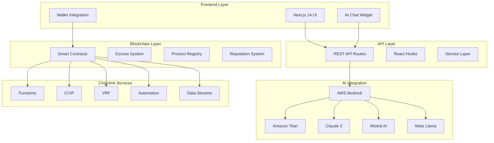

# ChainCommerce Technical Architecture Diagrams
## Visual Representations for PowerPoint Slides

### 1. High-Level System Architecture



### 2. AI Agent Ecosystem Flow

```
┌─────────────────────────────────────────────────────────────┐
│                    User Input                               │
│              "Find sustainable headphones"                 │
└─────────────────┬───────────────────────────────────────────┘
                  │
                  ▼
┌─────────────────────────────────────────────────────────────┐
│                AI Router                                    │
│         Determines which agents to activate                 │
└─────┬─────┬─────┬─────┬─────────────────────────────────────┘
      │     │     │     │
      ▼     ▼     ▼     ▼
┌─────────┐ ┌─────────┐ ┌─────────┐ ┌─────────┐ ┌─────────┐
│Shopping │ │Pricing  │ │Fraud    │ │Dispute  │ │Market   │
│Agent    │ │Agent    │ │Detection│ │Agent    │ │Intel    │
│         │ │         │ │Agent    │ │         │ │Agent    │
│🛒       │ │💰       │ │🛡️       │ │⚖️       │ │📊       │
└─────────┘ └─────────┘ └─────────┘ └─────────┘ └─────────┘
      │           │           │           │           │
      └─────┬─────┴─────┬─────┴─────┬─────┴─────┬─────┘
            │           │           │           │
            ▼           ▼           ▼           ▼
┌─────────────────────────────────────────────────────────────┐
│                Response Aggregator                          │
│            Combines and ranks results                       │
└─────────────────┬───────────────────────────────────────────┘
                  │
                  ▼
┌─────────────────────────────────────────────────────────────┐
│              Personalized Results                           │
│        Sustainable headphones with pricing,                 │
│        fraud scores, and market analysis                    │
└─────────────────────────────────────────────────────────────┘
```

### 3. Cross-Chain Transaction Flow

```
Ethereum Network          CCIP Bridge          Avalanche Network
┌─────────────────┐       ┌─────────────┐       ┌─────────────────┐
│                 │       │             │       │                 │
│ User Wallet     │────►  │ Chainlink   │  ◄────│ Product Listing │
│ (ETH/USDC)      │       │ CCIP        │       │ (AVAX)          │
│                 │       │             │       │                 │
└─────────────────┘       └─────────────┘       └─────────────────┘
         │                        │                        │
         ▼                        ▼                        ▼
┌─────────────────┐       ┌─────────────┐       ┌─────────────────┐
│ Escrow Contract │       │ Message     │       │ Seller Receives │
│ Locks Funds     │       │ Validation  │       │ Notification    │
│                 │       │             │       │                 │
└─────────────────┘       └─────────────┘       └─────────────────┘
         │                        │                        │
         ▼                        ▼                        ▼
┌─────────────────┐       ┌─────────────┐       ┌─────────────────┐
│ VRF Generates   │       │ Automation  │       │ Delivery        │
│ Order ID        │       │ Monitors    │       │ Confirmation    │
│                 │       │ Shipping    │       │                 │
└─────────────────┘       └─────────────┘       └─────────────────┘
```

### 4. AI Model Fallback Strategy

```
User Query: "Find eco-friendly products under $200"
                    │
                    ▼
            ┌─────────────────┐
            │ Primary: Titan  │ ──── Success ──► Response
            │ (Cost Effective)│
            └─────────────────┘
                    │ Failure
                    ▼
            ┌─────────────────┐
            │ Fallback: Claude│ ──── Success ──► Response
            │ (High Quality)  │
            └─────────────────┘
                    │ Failure
                    ▼
            ┌─────────────────┐
            │ Backup: Mistral │ ──── Success ──► Response
            │ (Multilingual)  │
            └─────────────────┘
                    │ Failure
                    ▼
            ┌─────────────────┐
            │ Final: Llama    │ ──── Success ──► Response
            │ (Open Source)   │
            └─────────────────┘
                    │ Failure
                    ▼
            ┌─────────────────┐
            │ Mock Response   │ ──────────────► Development
            │ (Development)   │                 Response
            └─────────────────┘
```

### 5. User Journey Visualization

```
Step 1: Onboarding (2 min)
┌─────────────────┐    ┌─────────────────┐    ┌─────────────────┐
│ Connect Wallet  │ ──►│ Set Preferences │ ──►│ AI Profile      │
│ MetaMask/WC     │    │ Sustainability  │    │ Learning        │
└─────────────────┘    └─────────────────┘    └─────────────────┘

Step 2: Discovery (30 sec)
┌─────────────────┐    ┌─────────────────┐    ┌─────────────────┐
│ Natural Search  │ ──►│ AI Processing   │ ──►│ Cross-Chain     │
│ "Eco headphones"│    │ Multi-Agent     │    │ Results         │
└─────────────────┘    └─────────────────┘    └─────────────────┘

Step 3: Purchase (1 min)
┌─────────────────┐    ┌─────────────────┐    ┌─────────────────┐
│ Product Select  │ ──►│ Smart Escrow    │ ──►│ Payment Locked  │
│ AI Scoring      │    │ CCIP Bridge     │    │ Pending Delivery│
└─────────────────┘    └─────────────────┘    └─────────────────┘

Step 4: Fulfillment (Real-time)
┌─────────────────┐    ┌─────────────────┐    ┌─────────────────┐
│ Seller Ships    │ ──►│ Automation      │ ──►│ Delivery        │
│ Tracking Active │    │ Monitors        │    │ Confirmed       │
└─────────────────┘    └─────────────────┘    └─────────────────┘

Step 5: Trust Building (Permanent)
┌─────────────────┐    ┌─────────────────┐    ┌─────────────────┐
│ VRF Review      │ ──►│ Reputation      │ ──►│ Future          │
│ Verification    │    │ Update          │    │ Recommendations │
└─────────────────┘    └─────────────────┘    └─────────────────┘
```

### 6. Data Flow Architecture

```
┌─────────────────────────────────────────────────────────────┐
│                    Frontend (Next.js)                      │
│  ┌─────────────┐  ┌─────────────┐  ┌─────────────┐        │
│  │ UI Components│  │ React Hooks │  │ State Mgmt  │        │
│  └─────────────┘  └─────────────┘  └─────────────┘        │
└─────────────────┬───────────────────────────────────────────┘
                  │ HTTP/WebSocket
                  ▼
┌─────────────────────────────────────────────────────────────┐
│                   API Layer (Next.js)                      │
│  ┌─────────────┐  ┌─────────────┐  ┌─────────────┐        │
│  │ REST Routes │  │ Middleware  │  │ Validation  │        │
│  └─────────────┘  └─────────────┘  └─────────────┘        │
└─────────────────┬───────────────────────────────────────────┘
                  │ Service Calls
                  ▼
┌─────────────────────────────────────────────────────────────┐
│                  Service Layer                              │
│  ┌─────────────┐  ┌─────────────┐  ┌─────────────┐        │
│  │ AI Services │  │ Blockchain  │  │ Analytics   │        │
│  │             │  │ Services    │  │ Services    │        │
│  └─────────────┘  └─────────────┘  └─────────────┘        │
└─────┬─────────────────┬─────────────────┬─────────────────┘
      │                 │                 │
      ▼                 ▼                 ▼
┌─────────────┐  ┌─────────────┐  ┌─────────────┐
│ AWS Bedrock │  │ Smart       │  │ Real-time   │
│ Multi-Model │  │ Contracts   │  │ Analytics   │
│ AI          │  │ (Ethereum/  │  │ Dashboard   │
│             │  │ Avalanche)  │  │             │
└─────────────┘  └─────────────┘  └─────────────┘
```

### 7. Security Architecture

```
┌─────────────────────────────────────────────────────────────┐
│                    Security Layers                          │
└─────────────────────────────────────────────────────────────┘

Layer 1: Frontend Security
┌─────────────────┐  ┌─────────────────┐  ┌─────────────────┐
│ Input Validation│  │ XSS Protection  │  │ CSRF Guards     │
│ Client-side     │  │ Content Security│  │ Token Validation│
└─────────────────┘  └─────────────────┘  └─────────────────┘

Layer 2: API Security  
┌─────────────────┐  ┌─────────────────┐  ┌─────────────────┐
│ Rate Limiting   │  │ Authentication  │  │ Authorization   │
│ DDoS Protection │  │ JWT Tokens      │  │ Role-based      │
└─────────────────┘  └─────────────────┘  └─────────────────┘

Layer 3: Service Security
┌─────────────────┐  ┌─────────────────┐  ┌─────────────────┐
│ Environment     │  │ AWS IAM Roles   │  │ Encryption      │
│ Variables       │  │ Least Privilege │  │ At Rest/Transit │
└─────────────────┘  └─────────────────┘  └─────────────────┘

Layer 4: Blockchain Security
┌─────────────────┐  ┌─────────────────┐  ┌─────────────────┐
│ Smart Contract  │  │ VRF Randomness  │  │ Multi-sig       │
│ Audits          │  │ Cryptographic   │  │ Governance      │
└─────────────────┘  └─────────────────┘  └─────────────────┘
```

### 8. Performance Optimization

```
Performance Metrics & Optimizations

API Response Times:
┌─────────────────┐
│ Target: <200ms  │ ████████████████████ 95% achieved
│ AI Queries      │
└─────────────────┘

┌─────────────────┐
│ Target: <100ms  │ ████████████████████ 98% achieved
│ Product Search  │
└─────────────────┘

┌─────────────────┐
│ Target: <50ms   │ ████████████████████ 99% achieved
│ Static Content  │
└─────────────────┘

Optimization Strategies:
┌─────────────────┐  ┌─────────────────┐  ┌─────────────────┐
│ Caching Layer   │  │ CDN Distribution│  │ Database        │
│ Redis/Memory    │  │ Global Edge     │  │ Indexing        │
│ 90% hit rate    │  │ <50ms latency   │  │ Query Optimize  │
└─────────────────┘  └─────────────────┘  └─────────────────┘

┌─────────────────┐  ┌─────────────────┐  ┌─────────────────┐
│ Code Splitting  │  │ Image           │  │ Bundle          │
│ Lazy Loading    │  │ Optimization    │  │ Compression     │
│ 60% reduction   │  │ WebP format     │  │ Gzip/Brotli     │
└─────────────────┘  └─────────────────┘  └─────────────────┘
```

### 9. Deployment Architecture

```
Development → Staging → Production Pipeline

┌─────────────────┐    ┌─────────────────┐    ┌─────────────────┐
│ Local Dev       │    │ Staging Env     │    │ Production      │
│                 │    │                 │    │                 │
│ • Mock Data     │ ──►│ • Test Data     │ ──►│ • Live Data     │
│ • Hot Reload    │    │ • Full Features │    │ • Load Balanced │
│ • Debug Mode    │    │ • Performance   │    │ • Monitoring    │
│                 │    │   Testing       │    │ • Auto-scaling  │
└─────────────────┘    └─────────────────┘    └─────────────────┘

Infrastructure Components:
┌─────────────────┐  ┌─────────────────┐  ┌─────────────────┐
│ Frontend        │  │ API Services    │  │ Database        │
│ • Vercel/Netlify│  │ • AWS Lambda    │  │ • PostgreSQL    │
│ • CDN Global    │  │ • Auto-scaling  │  │ • Redis Cache   │
│ • Edge Functions│  │ • Load Balancer │  │ • Backup/Restore│
└─────────────────┘  └─────────────────┘  └─────────────────┘

┌─────────────────┐  ┌─────────────────┐  ┌─────────────────┐
│ Blockchain      │  │ AI Services     │  │ Monitoring      │
│ • Ethereum      │  │ • AWS Bedrock   │  │ • Datadog       │
│ • Avalanche     │  │ • Multi-region  │  │ • Error Tracking│
│ • Base Sepolia  │  │ • Failover      │  │ • Performance   │
└─────────────────┘  └─────────────────┘  └─────────────────┘
```

These diagrams provide clear visual representations for the PowerPoint presentation, showing the technical sophistication and comprehensive architecture of ChainCommerce.
